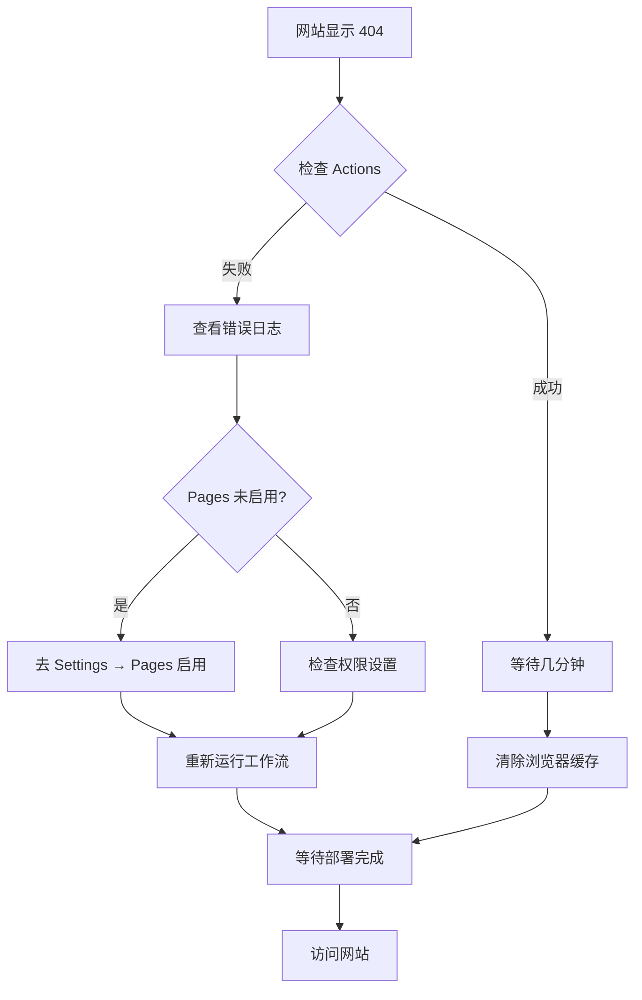

# GitHub Pages 部署流程总结与错误复盘

## 📋 项目概述

- **项目名称**: Hello World GitHub Pages 网站
- **仓库地址**: https://github.com/kongshan001/hello-world-page
- **网站地址**: https://kongshan001.github.io/hello-world-page/
- **部署方式**: GitHub Actions 自动化部署

---

## ✅ 完整操作流程

### 阶段 1: 项目初始化（使用 Agent）

#### 1.1 使用 github-pages-deployer Agent
```bash
# 调用专门的 GitHub Pages 部署 agent
# Agent 自动完成了以下工作：
```

**Agent 自动创建的文件：**

1. **index.html** - 精美的 Hello World 页面
   - 渐变紫色背景
   - 玻璃态效果
   - 响应式设计
   - 流畅动画效果

2. **.github/workflows/deploy.yml** - GitHub Actions 工作流
   - 自动部署配置
   - 推送到 main 分支自动触发
   - 支持手动触发

3. **.gitignore** - Git 忽略文件配置
   - 系统文件忽略
   - IDE 配置忽略

4. **README.md** - 详细的部署指南

5. **Git 仓库初始化**
   - 自动执行 `git init`

---

### 阶段 2: Git 基础操作

#### 2.1 添加文件到暂存区
```bash
git add .
```
**状态**: ✅ 成功

#### 2.2 创建初始提交
```bash
git commit -m "Initial commit: Add Hello World page

🤖 Generated with [Claude Code](https://claude.com/claude-code)

Co-Authored-By: Claude <noreply@anthropic.com>"
```
**状态**: ✅ 成功
- 提交了 4 个文件
- 新增 416 行代码

#### 2.3 设置默认分支
```bash
git branch -M main
```
**状态**: ✅ 成功

#### 2.4 添加远程仓库
```bash
git remote add origin https://github.com/kongshan001/hello-world-page.git
```
**状态**: ✅ 成功

---

### 阶段 3: 首次推送尝试与问题

#### 3.1 第一次推送失败
```bash
git push -u origin main
```

**错误信息**:
```
remote: Repository not found.
fatal: repository 'https://github.com/kongshan001/hello-world-page.git/' not found
```

**原因分析**:
- GitHub 仓库还未创建
- 必须先在 GitHub 网站上创建仓库，才能推送代码

---

### 阶段 4: 尝试安装 GitHub CLI（遇到问题）

#### 4.1 检查 gh 是否安装
```bash
gh --version
```
**结果**: ❌ 未安装

#### 4.2 尝试使用 Homebrew 安装
```bash
brew install gh
```

**遇到的问题**:
- 下载速度非常慢
- 长时间停留在下载阶段
- 用户等待体验不佳

**决策**: 🔄 切换方案 - 改为手动创建仓库

#### 4.3 停止安装进程
```bash
# 使用 KillShell 工具终止了安装进程
```
**状态**: ✅ 成功终止

---

### 阶段 5: 手动创建 GitHub 仓库

#### 5.1 在 GitHub 网站创建仓库
**步骤**:
1. 访问 https://github.com/new
2. 仓库名称: `hello-world-page`
3. 可见性: Public（公开）
4. **不勾选** README、.gitignore、LICENSE
5. 点击 "Create repository"

**状态**: ✅ 用户成功创建

---

### 阶段 6: 成功推送代码

#### 6.1 第二次推送
```bash
git push -u origin main
```

**结果**: ✅ 成功
```
branch 'main' set up to track 'origin/main'.
To https://github.com/kongshan001/hello-world-page.git
 * [new branch]      main -> main
```

---

### 阶段 7: GitHub Pages 配置错误（关键问题）

#### 7.1 访问网站出现 404 错误
**问题**: 访问 https://kongshan001.github.io/hello-world-page/ 显示 404

#### 7.2 GitHub Actions 部署失败
**错误信息**:
```
Run actions/configure-pages@v4
Error: Get Pages site failed. Please verify that the repository has Pages enabled
and configured to build using GitHub Actions, or consider exploring the `enablement`
parameter for this action.
Error: HttpError: Not Found
```

**根本原因分析**:
1. **GitHub Pages 功能未启用**
   - 推送代码后，GitHub Pages 默认是关闭的
   - 必须手动在仓库设置中启用

2. **工作流执行顺序问题**
   - Actions 工作流尝试部署到 Pages
   - 但 Pages 功能还未启用
   - 导致 configure-pages 步骤失败

---

### 阶段 8: 修复 GitHub Pages 配置

#### 8.1 更新工作流配置
**文件**: `.github/workflows/deploy.yml`

**修改内容**:
```yaml
- name: Setup Pages
  uses: actions/configure-pages@v4
  with:
    enablement: true  # 添加此行，自动启用 Pages
```

**提交并推送**:
```bash
git add .github/workflows/deploy.yml
git commit -m "Enable GitHub Pages auto-enablement in workflow"
git push
```
**状态**: ✅ 成功推送

#### 8.2 手动启用 GitHub Pages（必需步骤）

**访问设置页面**:
```
https://github.com/kongshan001/hello-world-page/settings/pages
```

**配置步骤**:
1. 找到 "Build and deployment" 部分
2. 在 "Source" 下拉菜单中选择 **"GitHub Actions"**
3. 保存配置

**额外配置（如果需要）**:
- Settings → Actions → General
- Workflow permissions: 选择 "Read and write permissions"
- 勾选 "Allow GitHub Actions to create and approve pull requests"

---

## 🐛 错误复盘总结

### 错误 1: Repository not found

**错误代码**: `E001`

**错误信息**:
```
remote: Repository not found.
fatal: repository 'https://github.com/kongshan001/hello-world-page.git/' not found
```

**发生阶段**: 第一次推送代码

**原因**:
- GitHub 远程仓库还不存在
- 本地 Git 已配置远程地址，但远程端没有对应仓库

**解决方案**:
1. ✅ 在 GitHub 网站手动创建仓库
2. ⚠️ 或使用 GitHub CLI (`gh repo create`) - 但需要先安装和认证

**经验教训**:
- 推送前必须确保远程仓库已创建
- 可以优先使用手动创建方式，更可靠快捷

---

### 错误 2: GitHub CLI 安装缓慢

**错误代码**: `E002`

**问题描述**:
```bash
brew install gh
# 下载速度极慢，长时间卡在下载阶段
```

**发生阶段**: 尝试安装 GitHub CLI

**原因**:
1. 网络连接速度慢
2. Homebrew 需要下载较大的安装包
3. 可能遇到 CDN 节点响应慢的问题

**解决方案**:
- ✅ 切换到手动创建仓库的方式
- ❌ 放弃等待 CLI 安装完成

**经验教训**:
- 不要过度依赖工具安装
- 当工具安装遇到阻碍时，应及时切换到替代方案
- 手动操作在某些情况下更可靠

**优化建议**:
```bash
# 如果确实需要安装 gh，可以考虑：
# 1. 使用预编译的二进制文件
# 2. 配置 Homebrew 镜像源
# 3. 直接从 GitHub Releases 下载
```

---

### 错误 3: GitHub Pages not enabled (最关键)

**错误代码**: `E003`

**错误信息**:
```
Error: Get Pages site failed. Please verify that the repository has Pages enabled
and configured to build using GitHub Actions, or consider exploring the `enablement`
parameter for this action.
Error: HttpError: Not Found
```

**发生阶段**: GitHub Actions 工作流执行

**完整错误流程**:
1. 代码成功推送到 GitHub
2. GitHub Actions 工作流自动触发
3. 执行到 `actions/configure-pages@v4` 步骤时失败
4. 访问网站显示 404

**根本原因**:
- **GitHub Pages 功能默认是关闭的**
- 必须手动在仓库设置中启用
- 工作流尝试配置 Pages，但 Pages 服务未启用

**技术细节**:
```yaml
# 工作流中的问题步骤
- name: Setup Pages
  uses: actions/configure-pages@v4
  # ❌ 缺少 enablement 参数
```

**解决方案（两步走）**:

**方案 1: 修改工作流（推荐）**
```yaml
- name: Setup Pages
  uses: actions/configure-pages@v4
  with:
    enablement: true  # 添加自动启用参数
```

**方案 2: 手动启用（必需）**
1. 访问: `Settings → Pages`
2. Source 选择: `GitHub Actions`
3. 保存配置

**为什么需要两步？**
- `enablement: true` 可以让工作流尝试自动启用
- 但首次启用通常仍需手动操作
- 手动启用后，后续部署就会自动进行

**经验教训**:
- GitHub Pages 不是"推送即用"的功能
- 新仓库必须先手动启用 Pages
- 工作流配置和仓库设置需要同步

**最佳实践**:
1. ✅ 创建仓库后立即启用 Pages
2. ✅ 工作流中添加 `enablement: true`
3. ✅ 设置正确的工作流权限
4. ✅ 验证部署状态后再访问网站

---

## 📊 操作时间线

```
1. [T+0min]  启动 github-pages-deployer agent
2. [T+2min]  Agent 完成文件创建
3. [T+3min]  执行 git add/commit/branch 操作
4. [T+4min]  第一次推送失败（仓库不存在）
5. [T+5min]  尝试安装 GitHub CLI
6. [T+8min]  CLI 安装缓慢，决定切换方案
7. [T+9min]  用户手动创建 GitHub 仓库
8. [T+10min] 第二次推送成功
9. [T+11min] 用户访问网站，发现 404 错误
10. [T+12min] 检查 Actions 日志，发现 Pages 未启用错误
11. [T+13min] 更新工作流配置
12. [T+14min] 推送工作流更新
13. [T+15min] 指导用户手动启用 GitHub Pages
```

**总耗时**: 约 15 分钟
**主要耗时环节**: GitHub CLI 安装尝试（约 4 分钟）

---

## 🎯 最佳实践总结

### 1. 项目初始化

**推荐流程**:
```bash
# 步骤 1: 使用 agent 生成项目文件
# 步骤 2: 在 GitHub 网站创建仓库
# 步骤 3: 立即在 Settings → Pages 启用 GitHub Pages
# 步骤 4: 执行 git 操作并推送
```

**避免的陷阱**:
- ❌ 先推送代码再创建仓库
- ❌ 推送后不立即启用 Pages
- ❌ 过度依赖自动化工具（如 gh CLI）

---

### 2. GitHub Pages 配置检查清单

#### ✅ 工作流配置
```yaml
# .github/workflows/deploy.yml
permissions:
  contents: read
  pages: write      # ✅ 必需
  id-token: write   # ✅ 必需

jobs:
  deploy:
    steps:
      - name: Setup Pages
        uses: actions/configure-pages@v4
        with:
          enablement: true  # ✅ 推荐添加
```

#### ✅ 仓库设置
- [ ] Settings → Pages → Source 选择 "GitHub Actions"
- [ ] Settings → Actions → General → Workflow permissions 选择 "Read and write"
- [ ] 仓库必须是 Public（或有 GitHub Pro）

#### ✅ 部署验证
- [ ] Actions 标签显示绿色对勾 ✓
- [ ] Pages 设置页面显示网站 URL
- [ ] 访问网站无 404 错误

---

### 3. 故障排查流程



---

## 📝 完整命令参考

### Git 操作命令
```bash
# 初始化和提交
git add .
git commit -m "Initial commit: Add Hello World page"
git branch -M main

# 添加远程仓库（替换为你的仓库地址）
git remote add origin https://github.com/YOUR_USERNAME/YOUR_REPO.git

# 推送代码
git push -u origin main

# 更新文件后的操作
git add .
git commit -m "Update files"
git push
```

### GitHub CLI 命令（可选）
```bash
# 安装 gh（macOS）
brew install gh

# 认证
gh auth login

# 创建仓库
gh repo create YOUR_REPO --public --source=. --remote=origin --push

# 启用 Pages
gh api repos/YOUR_USERNAME/YOUR_REPO/pages -X POST -f source[branch]=main
```

---

## 🔗 相关链接

- **仓库地址**: https://github.com/kongshan001/hello-world-page
- **网站地址**: https://kongshan001.github.io/hello-world-page/
- **Actions 日志**: https://github.com/kongshan001/hello-world-page/actions
- **Pages 设置**: https://github.com/kongshan001/hello-world-page/settings/pages
- **GitHub Pages 文档**: https://docs.github.com/pages
- **GitHub Actions 文档**: https://docs.github.com/actions

---

## 💡 经验与建议

### 对于初学者

1. **先创建仓库，再推送代码**
   - 避免 "Repository not found" 错误
   - 可以在创建时启用 Pages

2. **使用 GitHub 网页界面**
   - 比命令行工具更直观
   - 避免安装和配置的复杂性

3. **推送后立即检查 Actions**
   - 及时发现部署错误
   - 不要等到访问网站才发现问题

### 对于开发者

1. **使用 GitHub CLI 提高效率**
   - 一次性完成仓库创建和推送
   - 可以脚本化整个流程

2. **配置工作流模板**
   - 创建可复用的 workflow 模板
   - 减少重复配置

3. **自动化测试**
   - 添加链接检查
   - 添加部署后的验证步骤

---

## 🚀 快速启动模板

如果你要创建新的 GitHub Pages 项目，可以使用这个快速流程：

```bash
# 1. 创建项目目录
mkdir my-github-page && cd my-github-page

# 2. 创建 index.html
cat > index.html << 'EOF'
<!DOCTYPE html>
<html>
<head>
    <title>My Page</title>
</head>
<body>
    <h1>Hello World!</h1>
</body>
</html>
EOF

# 3. 创建 GitHub Actions 工作流
mkdir -p .github/workflows
cat > .github/workflows/deploy.yml << 'EOF'
name: Deploy to GitHub Pages
on:
  push:
    branches: [main]
  workflow_dispatch:

permissions:
  contents: read
  pages: write
  id-token: write

concurrency:
  group: "pages"
  cancel-in-progress: false

jobs:
  deploy:
    runs-on: ubuntu-latest
    environment:
      name: github-pages
      url: ${{ steps.deployment.outputs.page_url }}
    steps:
      - uses: actions/checkout@v4
      - uses: actions/configure-pages@v4
        with:
          enablement: true
      - uses: actions/upload-pages-artifact@v3
        with:
          path: '.'
      - id: deployment
        uses: actions/deploy-pages@v4
EOF

# 4. 初始化 Git
git init
git add .
git commit -m "Initial commit"
git branch -M main

# 5. 在 GitHub 创建仓库（手动）
# 访问 https://github.com/new

# 6. 推送代码（替换为你的仓库地址）
git remote add origin https://github.com/YOUR_USERNAME/YOUR_REPO.git
git push -u origin main

# 7. 启用 GitHub Pages（手动）
# 访问 Settings → Pages → Source → GitHub Actions
```

---

## 📅 创建日期

- **日期**: 2025-10-24
- **作者**: Claude Code Agent
- **版本**: 1.0

---

## 🔄 更新日志

### 2025-10-24
- ✅ 初始版本创建
- ✅ 记录完整部署流程
- ✅ 分析三个主要错误
- ✅ 提供解决方案和最佳实践
